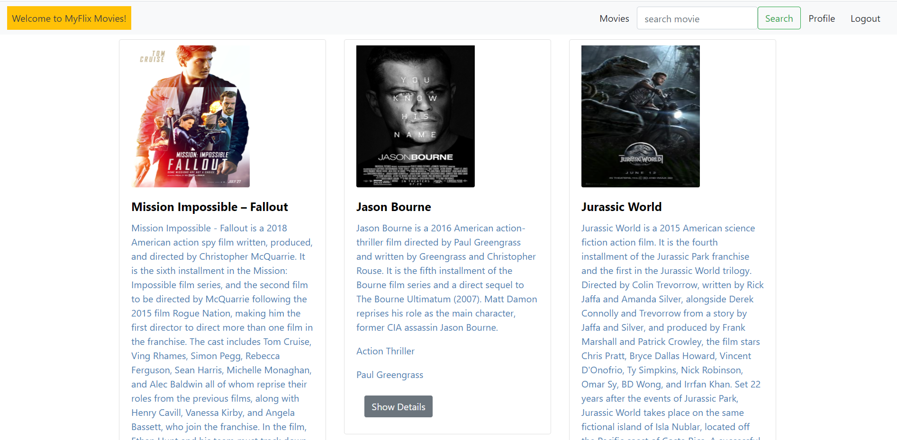

**myFlix Client**

**Project Objectives:**
To build the client-side component of a "movies" web application based on the existing server-side database. The web application will allow users to access information about different movies, directors and genres. Users will be able to log in, register, de-register, update their personal information and also create a list of their favorite movies securely.

**Built With**
* React
* React Redux
* React Bootstrap

**Stack**
* The complete project was developed using the MERN (MongoDB, Express.js, React.js, Node.js) stack

**Dependencies**
* Prop-types
* React
* React-bootstrap
* React-dom
* React-redux
* React-router-dom
* Redux
* Redux-devtools-extension

**Started Application Using**
* Parcel

**Author:**
:camel: Rina Ong-Oehme

**Acknowledgements:**
Matthew Wacha and Treasure Kabareebe

 
